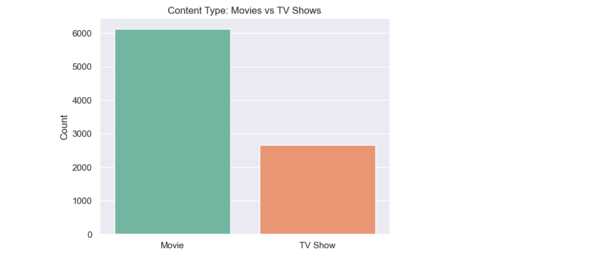
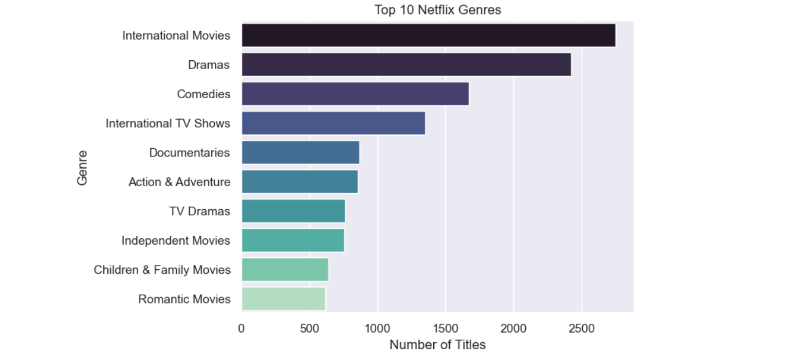

# 📺 Netflix Movies and TV Shows - EDA Project

## 📌 Overview
This is an Exploratory Data Analysis (EDA) project using the Netflix dataset from Kaggle.  
It explores patterns in Netflix content including content type, genres, countries, duration, directors, and more.

---

## 🔧 Tools & Libraries Used
- Python
- Pandas
- NumPy
- Matplotlib
- Seaborn
- Jupyter Notebook

---

## 📊 Key Insights

- **Content Type:** Netflix has more Movies (~69%) than TV Shows.
- **Top Countries:** United States, India, UK are top producers.
- **Popular Genres:** Dramas, International Movies, and Comedies dominate.
- **Growth:** Rapid increase in content post-2017.
- **Duration Trends:** Most movies are 90–100 minutes long.
- **Top Directors:** Rajiv Chilaka, Suhas Kadav, etc.

---

## 📊 Visualizations

### 🔸 Content Type: Movies vs TV Shows

### 🔸 Top 10 Netflix Genres

---

## 📁 Dataset
- Source: [Kaggle - Netflix Movies and TV Shows](https://www.kaggle.com/datasets/shivamb/netflix-shows)
- Format: CSV
- Columns: `title`, `director`, `cast`, `country`, `date_added`, `release_year`, `rating`, `duration`, etc.

---

